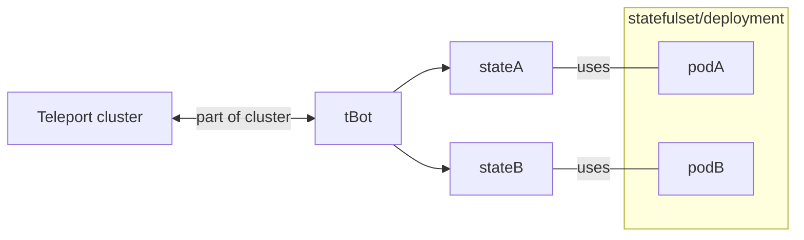
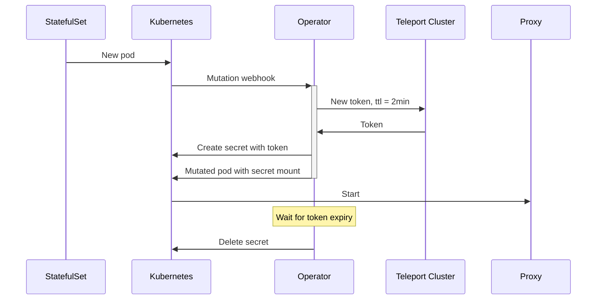
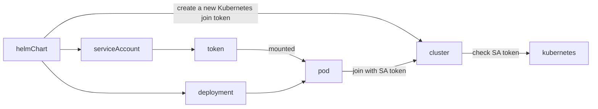
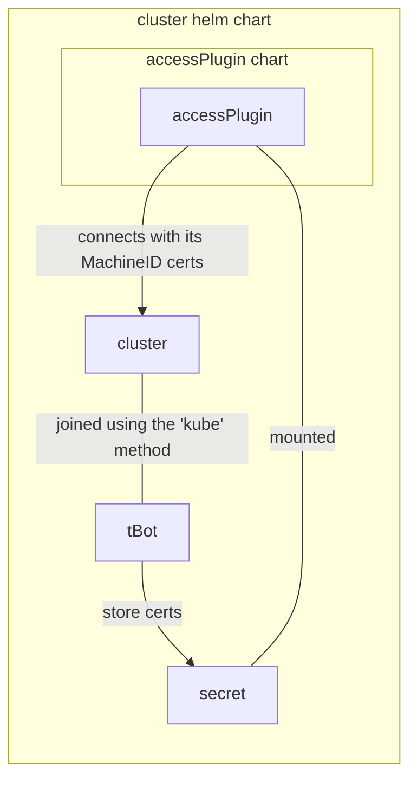

# RFD 0094 - Kubernetes node joining

## Required approvers

* Engineering: @r0mant && @gus
* Product: @klizhentas && @xinding33
* Security: @reedloden

## What

This RFD explores various methods for Teleport proxies to join a Teleport
cluster in a same-cluster Kubernetes context.

## Why

We want to refactor the `teleport-cluster`  Helm chart to be a reference
delivery method for Teleport. This involves deploying separately Teleport
auth and proxy nodes. Proxy nodes have to register against the Teleport auth
nodes without user interaction and without compromising the cluster security
(no long-lived tokens). Proxy nodes can be automatically created or deleted
(by a Kubernetes HPA for example).

User story: As a human operator deploying Teleport on Kubernetes I want
to deploy a working, secure and highly available Teleport cluster with a
single Helm command and no user interaction.

## Details

This RFD explores three different approaches on how to have proxies
automatically join the cluster.

The lasts section contains recommendations about which one to choose and why.

### Approach 1 - MachineID-generated certs

In this approach, proxies certificates are delivered by MachineID.

This approach brings the following challenges:
- each proxy requires multiple certs (one with the default teleport node role, the
  other with the proxy role)
- teleport does not support joining from certs (unless we manually build a valid state)
- tBot has to dynamically discover how many pods want certs and which certs they need
  (we don't have a streaming destination API yet)
- pods should have a way to access their specific state:
    - we can't mount a different secret in each pod
    - it can be done through admission webhooks
    - pods can read secrets (this works OK for Teleport nodes, but cannot be generalized
      with other workloads like access plugin because this requires being able to read
      all certs from the namespace)
    - pods can request a cert to tBot over HTTP
- tBot has to validate the identity of the pod requesting the certificate
- tBot has to join the cluster initially, which is almost the same problem that we're
  trying to address (almost because we have less constraints due to autoscaling). The
  easiest approach would be to bundle tBot with auth nodes and use the local admin
  socket to bootstrap it, like what we're doing with the operator

### Approach 2 - Operator/MachineID-generated short-lived tokens

In this approach, short-lived static tokens are generated by the Teleport operator and
injected in containers using mutation webhooks.

The operator internally relies on MachineID to get its identity, this solution is basically
an automated version of
[MachineID token generation](https://github.com/gravitational/teleport/discussions/15404).

This approach brings the following challenges:
- the operator becomes mandatory, which might not be a possibility for certain users
  (because of new additional RBAC)
- the operator enters the critical path, if it is not available no pod can start
- there is a race condition if the proxy pod does not start before expiry, the failure
  mode is a pod stuck in crashloop and required deleting the pod. This is particularly
  likely to happen on clusters with node autoscaling or capacity issues.

### Approach 3 - A new join method

In this approach we introduce a new 'kubernetes' join method (like ec2 or iam ones).
Token using this method can be long-lived with less security implications
because they are not secret and rely on Kubernetes as a trusted third party.

This approach is basically extending [RFD 0050](./0050-join-methods.md).

This approach brings the following challenges:
- helmChart has to create a Teleport join token for its service account:
  - this can be done through the Teleport operator and a TeleportToken resource
    (we are due to implement tokens anyway to reach parity between the operator
    and the Terraform provider)
  - this can be done through a bootstrap resource on cluster creation
- Kubernetes only supports (read enabled by default) short-lived renewed token after 1.21.
  For prior versions we have to use the default long-lived tokens produced by Kubernetes.

### Comparison and conclusion

The first approach tends to bring more issues than it solves. Even if we added MachineID
support for Teleport nodes, this would not be used by customers with their Teleport workload.

The second approach adds new components in the critical path and new complex failure modes.

The third approach seems the more robust, leverages previous work with joinTokens and provides
very solid security guarantees for Kubernetes 1.21+. MachineID would also benefit from it
as `tBot` would be easily deployed in a Kubernetes cluster hosting a Teleport cluster. This
would pave the way for a better experience for users hosting access plugins next to the
Teleport control plane.

